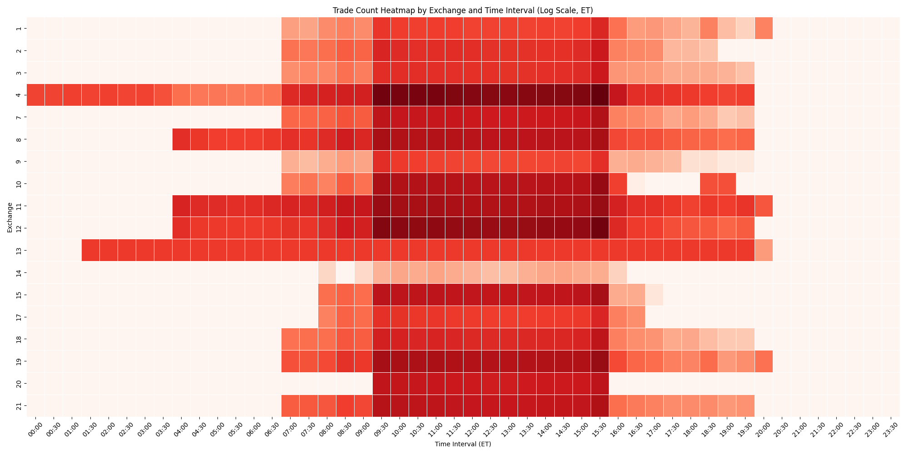
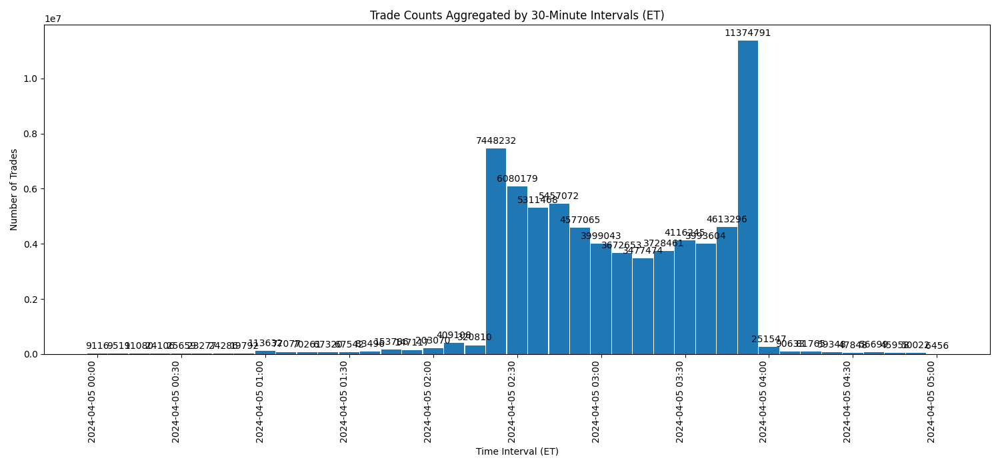

# Polygon.io Flat Files Stock Trades Analysis Scripts

This repository contains Python scripts for analyzing stock market trading data using Flat Files from Polygon.io. These scripts demonstrate various ways to dissect and visualize trade data for comprehensive market analysis.

Please see the tutorial: [Deep Dive into Trade-Level Data with Flat Files](https://polygon.io/blog/insights-from-trade-level-data)

## Scripts Overview

### **exchange-heatmap.py**
This script aggregates trades by exchange into 30-minute chunks and creates a heatmap visualization. It highlights the flow of trades and peak activity times across different exchanges, providing insights into how different exchanges operate throughout the day.



### **exchanges-seen.py**
Analyzes the distribution of trades across different exchanges and calculates their respective percentages of total trades. This script helps identify which exchanges handle the most trading volume, offering a perspective on market structure.

```
Exchange 4: 25,570,324 trades, 36.32% of total trades
Exchange 12: 15,147,689 trades, 21.52% of total trades
Exchange 11: 6,877,306 trades, 9.77% of total trades
Exchange 19: 5,098,852 trades, 7.24% of total trades
Exchange 10: 4,006,611 trades, 5.69% of total trades
Exchange 8: 3,686,168 trades, 5.24% of total trades
Exchange 15: 2,446,340 trades, 3.47% of total trades
Exchange 21: 2,173,744 trades, 3.09% of total trades
Exchange 7: 1,509,083 trades, 2.14% of total trades
Exchange 20: 1,296,811 trades, 1.84% of total trades
Exchange 18: 674,553 trades, 0.96% of total trades
Exchange 13: 527,767 trades, 0.75% of total trades
Exchange 2: 417,295 trades, 0.59% of total trades
Exchange 3: 393,919 trades, 0.56% of total trades
Exchange 17: 230,210 trades, 0.33% of total trades
Exchange 1: 183,010 trades, 0.26% of total trades
Exchange 9: 159,020 trades, 0.23% of total trades
Exchange 14: 1,211 trades, 0.00% of total trades
```

### **top-10-tickers.py**
Identifies the top 10 most traded stocks and calculates their respective percentages of the total trades. This script provides a clear view of the market's most active stocks, highlighting where the most trading activity is concentrated.

```
TSLA: 1,549,605 trades, 2.20% of total trades
NVDA: 788,331 trades, 1.12% of total trades
SPY: 669,762 trades, 0.95% of total trades
AMD: 587,140 trades, 0.83% of total trades
MDIA: 561,698 trades, 0.80% of total trades
AAPL: 540,870 trades, 0.77% of total trades
SOXL: 533,511 trades, 0.76% of total trades
QQQ: 508,822 trades, 0.72% of total trades
CADL: 466,604 trades, 0.66% of total trades
AMZN: 465,526 trades, 0.66% of total trades
```

### **trades-histogram.py**
Creates a histogram that aggregates trades into 30-minute intervals throughout the day. This visualization helps understand the distribution of trading volume across different times, including pre-market, regular trading hours, and after-hours.



## Download the Data

First, let's download an actual file and explore the data and see what we can learn. We start by downloading the trades for 2024-04-05 via the [File Browser](https://polygon.io/flat-files/stocks-trades/2024/04). The `us_stocks_sip/trades_v1/2024/04/2024-04-05.csv.gz` file is about 1.35GB and is in a compressed gzip format.

```
gunzip 2024-04-05.csv.gz
```

## Getting Started

To run these scripts, you will need Python 3 and several dependencies installed, including pandas, matplotlib, seaborn, and pytz. Ensure that you have the trading data file available and modify the `file_path` variable in each script to point to your data file location.

```
pip install pandas matplotlib seaborn pytz
```

## Usage

Each script is designed to be run independently:

```bash
python exchange-heatmap.py
python exchanges-seen.py
python top-10-tickers.py
python trades-histogram.py
```

Adjust the script parameters as necessary to fit your specific analysis needs or to accommodate different datasets.