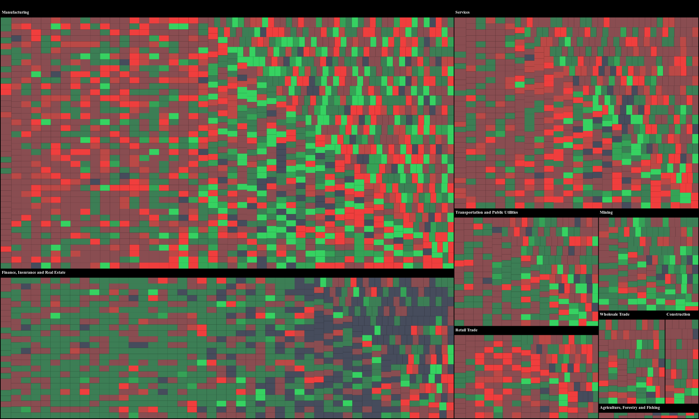

# Mapping Market Movements with Polygon.io and D3.js Treemap

This repository offers a tutorial on how to create a Treemap visualization of the current stock market conditions. Using D3.js Treemap, Polygon.io's [Snapshot API](https://polygon.io/docs/stocks/get_v2_snapshot_locale_us_markets_stocks_tickers), and the [python-client library](https://github.com/polygon-io/client-python), we'll guide you through building an interactive visualization. The Snapshot API allows us to fetch the most recent market data for all US-traded stocks, transforming them into color-coded nested rectangles within the Treemap. This presents an insightful and interactive snapshot of the market's current status.



Please see the [tutorial](https://polygon.io/blog/market-movements-with-treemap) for more details.

## Structure

The repo consists of:

- `polygon_sic_code_data_gatherer.py`: Builds ticker to SIC code mapping for treemap groups.
- `sic_code_groups.json`: Pre-built JSON file containing grouped ticker to SIC code data.
- `treemap_server.py`: Simple server to host the treemap visualization (requires sic_code_groups.json).

For those interested in the underlying mechanics, the `polygon_sic_code_data_gatherer.py` script retrieves a snapshot of all ticker symbols, processes each one to obtain its SIC code via the Ticker Details API, and then saves these classifications into the file named `sic_code_groups.json`.

The logic of this SIC code-to-group enables us to transform a large dataset into a neatly structured visualization. This structured approach facilitates easy identification of market conditions, providing a snapshot of the market's overall health. You don't need to do anything since it is pre-built but we added the script if you wanted to modify anything.

## Getting Started

Setting up and visualizing the stock market's current conditions is straightforward. All you'll need to do is clone the repository, secure an API key from Polygon.io, install the required Python library, launch the visualization server example, and then dive into the visualization through your web browser.

### Prerequisites

- Python 3.x
- Polygon.io account and API key

### Setup

1. Clone the repository:
   ```
   git clone https://github.com/polygon-io/client-python.git
   ```

2. Install the necessary Python packages. 
   ```
   pip install -U polygon-api-client
   ```

3. Store your Polygon.io API key securely, or set it as an environment variable:
   ```
   export POLYGON_API_KEY=YOUR_API_KEY_HERE
   ```

### Running the Treemap Server

Change into the treemap example directory and execute the `treemap_server.py` script:
```
cd examples/tools/treemap
python3 treemap_server.py
```

Upon successful execution, the server will start, and you can view the treemap visualization by navigating to:
```
http://localhost:8889
```

That’s it. You'll now see a Treemap that organizes over 4,000+ US-traded stocks into 10 distinct categories. Use the dropdown box in the top left corner to select different categories and delve deeper into the data.